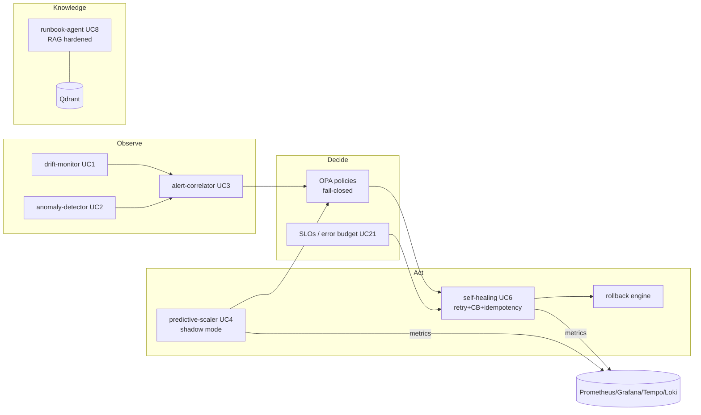

# Observable MLOps Platform

An enterprise-grade **AIOps + MLOps** reference platform that shows how to run
machine-learning and platform-operations workloads the way mature SaaS companies
do: **closed-loop, policy-gated, observable, and fail-safe by default**. It packages
**23 use cases** (drift detection, log-anomaly detection, alert correlation,
predictive scaling, self-healing, RAG runbooks, cost optimization, and more), each
with a **blocking CI eval gate** so value is *proven*, never merely claimed.

- **Repo**: https://github.com/sanjeev0120test/observable-mlops-platform
- **MLflow / DVC remote**: https://dagshub.com/sanjeev0120test/observable-mlops-platform
- **Eval portal**: published by `91-publish-portal` after CI is green

> **Status:** all CI workflows green — 23 per-UC eval gates + lint/structure,
> unit tests (101), OPA policy tests (30), chaos/k8s manifest validation, SBOM,
> and end-to-end aggregation. Every use case must clear its threshold before merge.

---

## 1. What this is

This is a *system of systems*. Instead of documenting individual tools, it wires
them into feedback loops that mirror production reliability engineering:

```
observe  →  orient  →  decide  →  act  →  (verify) → observe …
 UC1/UC2     UC3/UC11   OPA/SLO    UC6/UC4/UC22      eval gates
 drift/log   correlate  policy     remediate/scale   CI + Prometheus
```

Every use case (UCx) is isolated in its own folder and GitHub Actions workflow so
you can adopt any single piece without taking the whole platform.

## 2. Why it exists (the problem)

Most ML/ops stacks fail in production for a small number of recurring reasons.
This platform is opinionated about each one:

| Failure mode in the wild | Enterprise pattern applied here | Where it lives |
|---|---|---|
| "Works in the demo" but not measured | Blocking **eval gates** in every workflow | `eval/`, all `.github/workflows/*` |
| Autonomous actions with no guardrails | **Fail-closed** policy engine (OPA) | `services/self-healing/`, `aiops/policies/opa/` |
| A dependency blip triggers wrong actions | **Retries + circuit breaker + idempotency** | `services/self-healing/src/resilience.py` |
| Models/decisions go live unproven | **Shadow mode / online evaluation** with a promotion gate | `platform/shadow-mode/` |
| Untested reliability claims | **Chaos engineering** (Chaos Mesh + Litmus) + **k6 load** | `platform/chaos/`, `tests/load/` |
| LLM answers hallucinate / get injected | **RAG hardening**: sanitization, grounding, injection defense | `services/runbook-agent/` |
| Insecure workloads reach the cluster | Non-root images, **NetworkPolicy/PDB**, Kyverno, Trivy, SBOM | `infra/kubernetes/`, `aiops/`, `.github/workflows/28-*` |

## 3. Core design invariants

1. **Value is proven in CI, not estimated** — each UC writes metrics and must clear a threshold in `eval/scorer.py`.
2. **Fail-closed by default** — if the policy engine is unreachable, remediation is **blocked** (HTTP 503), never allowed.
3. **Control plane ≠ data plane** — decisions (policy, scale, promote) are separated from work (inference, logs).
4. **Blast-radius containment** — namespace allowlists, replica caps, canaries, error budgets.
5. **Single source of truth** — Git + model registry + Backstage catalog; controllers reconcile to declared state.

## 4. Architecture at a glance



## 5. Project structure

Complete tree with the responsibility of each area. This is the map to read the
repo end-to-end.

```text
observable-mlops-platform/
├── README.md                      # This document
├── Makefile                       # dev / test / lint / ci-local targets
├── pyproject.toml                 # Ruff + Black + pytest + mypy config
├── requirements.txt               # Python dependency set (ML, MLOps, serving, dev)
├── renovate.json                  # Automated dependency updates
├── .pre-commit-config.yaml        # pre-commit hooks (ruff, black-style, hadolint, hygiene)
│
├── services/                      # Runtime microservices (FastAPI), one per use case
│   ├── self-healing/              # UC6 — remediation brain (OPA-gated, FAIL-CLOSED)
│   │   ├── src/main.py            #   API: /api/v1/remediate, retries+CB+idempotency
│   │   ├── src/resilience.py      #   Retry(backoff+jitter) + CircuitBreaker primitives
│   │   └── Dockerfile             #   Non-root, read-only-fs friendly, healthcheck
│   ├── runbook-agent/             # UC8/UC23 — RAG Q&A over runbooks (Qdrant + Ollama)
│   │   ├── src/main.py            #   Sanitization, grounded answers, injection defense
│   │   └── runbooks/              #   Markdown runbooks indexed into the vector store
│   ├── drift-monitor/             # UC1 — KS/PSI/NannyML/Alibi drift + Evidently report
│   ├── anomaly-detector/          # UC2 — log-anomaly detection (LSTM autoencoder)
│   ├── alert-correlator/          # UC3 — DBSCAN alert-storm de-duplication
│   ├── predictive-scaler/         # UC4 — load forecast + KEDA pre-scale (shadow mode)
│   └── cost-optimizer/            # UC10 — cloud cost anomaly + attribution
│
├── platform/                      # Cross-cutting platform capabilities (reusable)
│   ├── shadow-mode/               # Online evaluation engine + KServe traffic mirror
│   │   ├── shadow_evaluator.py    #   Binary + forecast evaluators with promotion gates
│   │   └── kserve-shadow.yaml     #   Traffic-mirroring manifest
│   ├── chaos/                     # Chaos Mesh / Litmus fault-injection scenarios
│   │   ├── opa-unavailable.yaml   #   Verifies self-healing stays fail-closed
│   │   ├── memory-and-pod-resilience.yaml  # memory hog + pod-kill + verifier + Litmus
│   │   └── redis-latency.yaml     #   Dependency latency injection
│   ├── rollback/auto_rollback.py  # Model auto-rollback via self-healing (OPA-gated)
│   ├── logging/structured_logger.py  # JSON structured logging helper
│   └── slo-definitions/           # SLO/SLI definitions + burn-rate targets
│
├── aiops/                         # Policy-as-code and runtime security
│   ├── policies/opa/              # Rego: self_healing.rego, model_promotion.rego (+ tests)
│   ├── policies/kyverno/          # Admission policies (disallow-privileged, require-labels)
│   ├── falco/                     # Runtime threat-detection rules
│   └── n8n-workflows/             # Event-driven remediation orchestration
│
├── mlops/                         # ML lifecycle assets
│   ├── experiments/               # Training code (pod-failure, log-anomaly, cost)
│   ├── feature-store/             # Feast feature repository
│   ├── pipelines/airflow/         # Retrain DAGs (drift-triggered) + OpenLineage
│   ├── pipelines/kubeflow/        # KFP component scaffolds
│   └── serving/                   # KServe / FastAPI serving scaffolds
│
├── llmops/ragas/                  # RAGAS-style evaluation harness for the RAG agent
├── eval/                          # Unified eval framework (thresholds + scorer/gate)
│   ├── metrics.py                 # Per-UC metric specs and CI thresholds
│   └── scorer.py                  # compute_score + run_eval_gate (fails CI on miss)
│
├── observability/                 # Telemetry configuration
│   ├── otel/                      # OpenTelemetry collector pipelines (traces/metrics/logs)
│   ├── alerts/                    # Prometheus + Alertmanager rules (tagged uc: UCx)
│   └── dashboards/grafana/        # Grafana dashboards / provisioning
│
├── infra/                         # Infrastructure as code / manifests
│   ├── docker-compose/            # Local stacks: observability, mlops-core, services
│   ├── kubernetes/base/           # Production-hardened manifests (Deployment/PDB/NetworkPolicy)
│   ├── kind/                      # Local Kind cluster configs
│   ├── helm/                      # Helm values (KEDA, Kyverno, KServe, Falco, Kubeflow)
│   ├── terraform/                 # aws-eks / gcp-gke scaffolds
│   └── crossplane/                # Crossplane composition scaffold
│
├── data/synthetic/               # Deterministic synthetic data generators + dvc.yaml
├── governance/eu-ai-act/         # EU AI Act compliance checks
├── backstage/                    # Software catalog (catalog-info.yaml) + TechDocs
├── scripts/                      # setup-kind, setup-ollama, setup-dagshub, run-all-workflows
├── tests/
│   ├── unit/                     # pytest suites (services, eval, resilience, shadow, RAG)
│   └── load/                     # k6 load tests (self-healing, drift-monitor, runbook-agent)
├── portal/                       # Static eval portal published to GitHub Pages
├── docs/images/                  # Local observability lab screenshots (51)
└── .github/workflows/            # 29 numbered workflows + e2e + portal publish
```

## 6. Use cases (23)

Each UC has a workflow (`.github/workflows/NN-*.yml`), an eval gate, and (where it
runs as a service) code under `services/` or `platform/`.

| UC | Capability | Primary asset |
|----|------------|---------------|
| UC1 | ML data/prediction drift | `services/drift-monitor` |
| UC2 | Log anomaly detection | `services/anomaly-detector` |
| UC3 | Alert-storm correlation | `services/alert-correlator` |
| UC4 | Predictive autoscaling (shadow) | `services/predictive-scaler` |
| UC5 | Feature train/serve skew | `mlops/feature-store` |
| UC6 | Self-healing remediation | `services/self-healing` |
| UC7 | Supply-chain / CVE / admission | `aiops/`, `.github/workflows/13,28` |
| UC8 | RAG runbook Q&A | `services/runbook-agent` |
| UC9 | Safe model promotion | `aiops/policies/opa/model_promotion.rego` |
| UC10 | Cloud cost anomaly | `services/cost-optimizer` |
| UC11 | Distributed tracing RCA | `observability/otel` |
| UC12 | GitOps drift | `.github/workflows/19` |
| UC13 | Data quality gates | `.github/workflows/20` |
| UC14 | Hyperparameter optimization | `.github/workflows/21` |
| UC15 | DORA metrics | `.github/workflows/14` |
| UC16 | Error classification | `.github/workflows/22` |
| UC17 | Model explainability (SHAP) | `.github/workflows/23` |
| UC18 | Predictive rate limiting | `.github/workflows/24` |
| UC19 | Data profiling / constraints | `.github/workflows/25` |
| UC20 | Service catalog validation | `backstage/` |
| UC21 | SLO / error-budget monitoring | `platform/slo-definitions` |
| UC22 | A/B testing + auto-promote | `platform/shadow-mode` |
| UC23 | Auto post-mortem | `services/runbook-agent` |

## 7. Production patterns in this repo

These are the enterprise patterns most worth studying:

- **Fail-closed policy enforcement** — `self-healing` never allows a remediation when OPA is unreachable; it returns HTTP 503 and increments `self_healing_opa_unavailable_total`. Proven by unit tests and the `opa-unavailable` chaos scenario.
- **Resilient external calls** — OPA queries use exponential backoff + jitter and a circuit breaker (`resilience.py`); retries handle transient faults, then the request still fails closed.
- **Idempotent remediation** — duplicate remediation requests (same action/target/trigger, or an explicit `idempotency_key`) are de-duplicated within a TTL so retrying callers can't double-execute.
- **Defence in depth** — hard-coded protected namespaces in code *and* in the OPA policy; OPA also validates target fields and enforces a replica blast-radius cap.
- **Online evaluation / shadow mode** — `shadow_evaluator.py` scores would-be decisions vs ground truth and only recommends promotion once precision/recall/FPR (or forecast MAE) clear a gate. Predictive scaling ships in shadow mode by default.
- **RAG hardening** — prompt-injection sanitization, bounded `top_k`, deterministic unit-norm fallback embeddings, and a faithfulness (answer-vs-context) grounding score.
- **Chaos + load** — Chaos Mesh/Litmus scenarios (OPA partition, pod-kill, memory/CPU stress, network latency) with in-cluster verifier Jobs, plus k6 load tests asserting latency budgets and that policy never bypasses under load.
- **Container & cluster hardening** — non-root images, read-only root filesystem, dropped capabilities, resource limits, liveness/readiness/startup probes, PodDisruptionBudget, and default-deny NetworkPolicies (`infra/kubernetes/base/`).

## 8. Quickstart (local)

```bash
# Python tooling
python -m pip install -r requirements.txt

# Run the unit test suite
make test-unit          # or: python -m pytest tests/unit -q

# Lint exactly as CI does
make lint               # ruff check . + black --check .

# OPA policy tests (requires the opa binary)
make test-opa           # opa test aiops/policies/opa/ -v

# Bring up local stacks (Docker)
make dev                # observability + services via docker-compose
```

Key local endpoints (see `Makefile`): Grafana `:3000`, MLflow `:5000`,
drift-monitor `:8002`, self-healing `:8005`, runbook-agent `:8006`, OPA `:8181`.

## 9. Testing & CI

- **Unit tests** (`tests/unit/`): services, eval framework, resilience, shadow-mode, and RAG hardening — run in workflows `27` and `29`.
- **OPA policy tests** (`aiops/policies/opa/*_test.rego`): run in `00` and `27`.
- **Load tests** (`tests/load/*.js`): k6 scripts for self-healing, drift-monitor, runbook-agent.
- **Chaos validation** (`29`): validates every chaos manifest and the hardened k8s manifests.
- **Lint/format/structure** (`00`): ruff, black, actionlint, directory/file structure, eval-framework smoke tests.
- **Per-UC workflows** (`01`–`26`, `28`): each collects metrics and runs its eval gate.
- **End-to-end** (`90`): aggregates all UC scores; `91` publishes the portal.

Run everything locally with `make ci-local` (lint + tests + data generators).

## 10. Security & governance

- **Policy-as-code**: OPA (remediation + model promotion) and Kyverno (admission).
- **Runtime security**: Falco rules for anomalous container behavior.
- **Supply chain**: Trivy scanning and SBOM + image signing (`28-sbom-signing`).
- **Least privilege**: non-root containers, dropped Linux capabilities, default-deny NetworkPolicies.
- **Compliance**: EU AI Act checks under `governance/eu-ai-act/`.

## 11. Observability

OpenTelemetry collector fans out traces, metrics, and logs to
Prometheus / Tempo / Loki, visualized in Grafana. Alert rules are tagged with
`uc: UCx` so every alert maps back to a use case. A hands-on walkthrough with
51 screenshots lives in `docs/images/local-observability-lab/`.

## 12. Contributing

1. Create a `feature/*` or `fix/*` branch.
2. Keep it green locally: `make lint && make test`.
3. Add or update tests for any behavior change.
4. Open a PR — the `00-pr-validate` gate and per-UC gates must pass.

## License

See [LICENSE](LICENSE).
