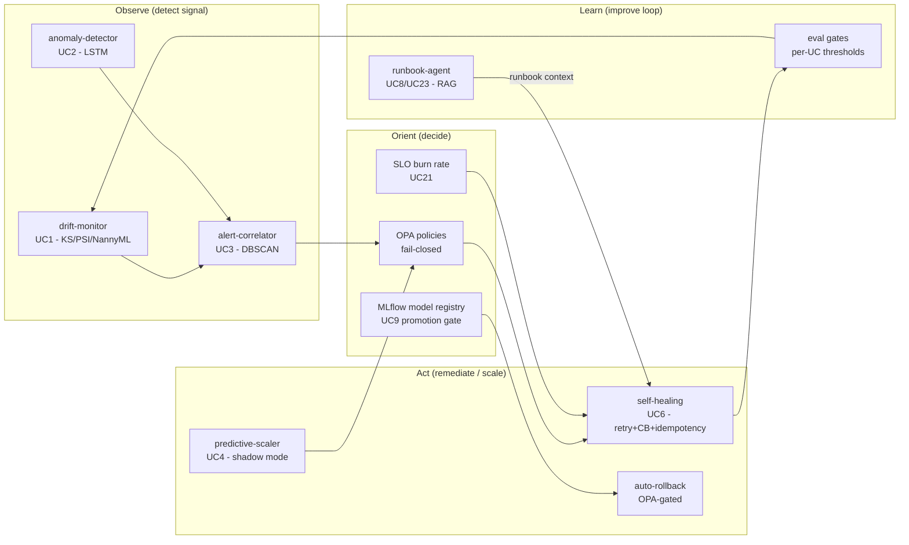
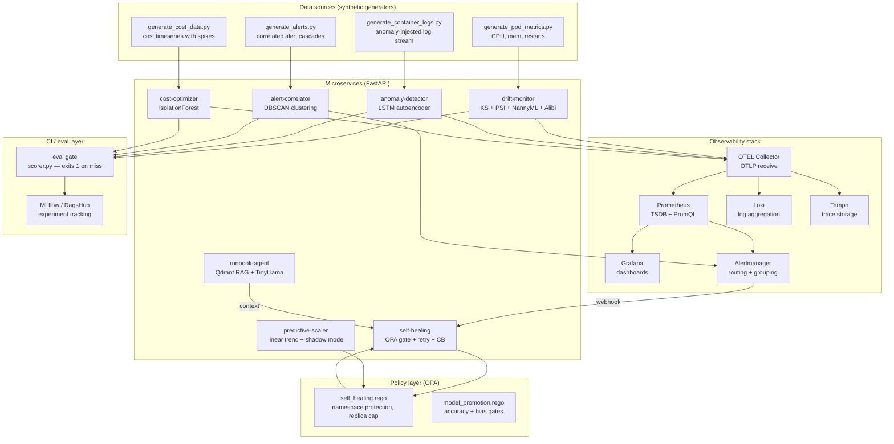
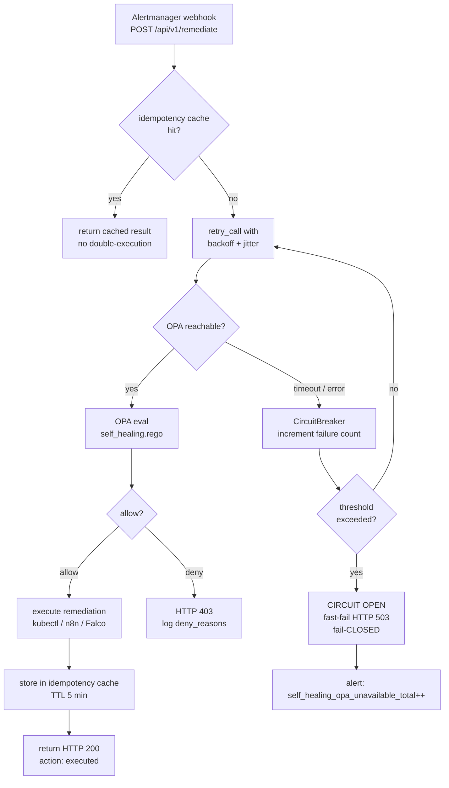
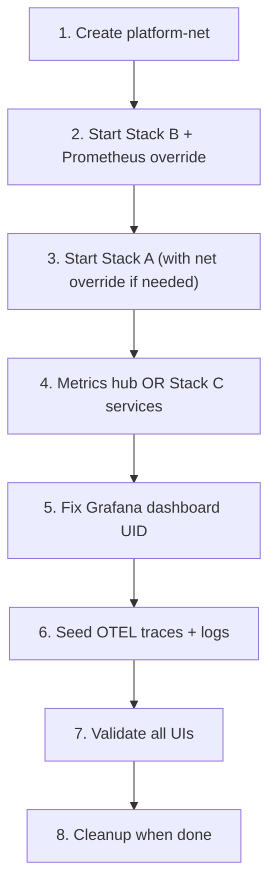

# Observable MLOps Platform

An enterprise-grade **AIOps + MLOps** reference platform that shows how to operate
machine-learning workloads the way senior engineers at hyperscalers do it:
**closed-loop, policy-gated, observable, and fail-safe by default**.

It packages **23 use cases** across the full ML/Ops lifecycle — drift detection, alert
correlation, self-healing, RAG runbooks, cost optimization, and more — each backed by a
**blocking CI eval gate** so correctness is *proven in code*, never claimed in prose.

- **Repo:** <https://github.com/sanjeev0120test/observable-mlops-platform>
- **MLflow / DVC remote:** <https://dagshub.com/sanjeev0120test/observable-mlops-platform>
- **Eval portal:** <https://sanjeev0120test.github.io/observable-mlops-platform/>

> **CI status (2026):** all 29 workflows green — 23 UC eval gates + lint/structure
> (ruff, black, actionlint), 101 unit tests, 30 OPA policy tests, chaos/k8s manifest
> validation, SBOM signing, and E2E aggregation. Every UC must clear its numeric
> threshold before a commit lands on `main`.

---

## Table of contents

1. [The problem this solves](#1-the-problem-this-solves)
2. [Core design invariants](#2-core-design-invariants)
3. [Architecture and data flow](#3-architecture-and-data-flow)
4. [Tech stack and trade-offs](#4-tech-stack-and-trade-offs)
5. [Project structure](#5-project-structure)
6. [Use cases (23)](#6-use-cases-23)
7. [Key production patterns](#7-key-production-patterns)
8. [Quickstart](#8-quickstart)
9. [CI reference](#9-ci-reference)
10. [Security and governance](#10-security-and-governance)
11. [Local Observability Lab — Runbook & Lessons Learned](#11-local-observability-lab--runbook--lessons-learned)
12. [Contributing](#12-contributing)

---

## 1. The problem this solves

### Real production failures — and how this platform addresses each

| Failure mode (observed in real orgs) | Enterprise pattern applied | Where it lives |
|---|---|---|
| ML model degrades silently for weeks | **Blocking eval gates** — every UC writes structured metrics that must clear a threshold | `eval/`, all `*.github/workflows/*` |
| "Works in the demo" but not in production | **CI-driven proof** — gates run on every push, not just on launch day | `eval/scorer.py`, per-UC workflows |
| Autonomous remediation causes a bigger outage | **Fail-closed OPA** — if the policy engine is unreachable, action is blocked (HTTP 503), never allowed | `services/self-healing/`, `aiops/policies/opa/` |
| A blip in a dependency triggers double-remediation | **Retry + circuit breaker + idempotency** — transient faults are retried; duplicate calls are de-duped | `services/self-healing/src/resilience.py` |
| Models promoted without A/B or shadow validation | **Shadow mode + promotion gate** — decisions scored vs ground truth before any traffic receives them | `platform/shadow-mode/shadow_evaluator.py` |
| One root cause produces 50 alert pages | **DBSCAN alert correlation** — cascades grouped into one incident; FPR gate enforced | `services/alert-correlator/` |
| LLM runbook answers hallucinate or get injected | **RAG hardening** — sanitize input, bound retrieval, score groundedness, reject unsupported answers | `services/runbook-agent/src/main.py` |
| Engineers run `kubectl exec` and modify live state | **GitOps + Kyverno** — only declared state is applied; admission webhooks block drift | `aiops/policies/kyverno/`, `19-gitops-drift.yml` |
| Insecure images reach the cluster | **Trivy + SBOM + Cosign** — scan every image build; sign with keyless OIDC | `.github/workflows/28-sbom-signing.yml` |
| On-call burnout from non-actionable alerts | **DORA metrics + SLO burn-rate alerting** — alert only when error budget is actually burning | `observability/alerts/rules/platform.yml` |

### The systems-thinking model



---

## 2. Core design invariants

These seven principles are non-negotiable. Every architecture decision in this repo
can be traced back to at least one of them.

| # | Invariant | Why it matters | Violation example |
|---|---|---|---|
| 1 | **Value is CI-proven, not estimated** | Removes "it works on my machine" from the vocabulary | Claiming drift detection works without a numerical gate |
| 2 | **Fail-closed by default** | Any ambiguity or unavailability defaults to the safe state | OPA returns a network error → action is BLOCKED, not allowed |
| 3 | **Control plane ≠ data plane** | Policy decisions (OPA, SLO budgets) are decoupled from execution | Self-healing service making its own policy decisions without OPA |
| 4 | **Blast-radius containment** | No single action can take down the entire system | Scale-out limited by replica cap; protected namespaces hard-coded |
| 5 | **Single source of truth** | Git for config, MLflow for experiments, Backstage for catalog | Two places claim to be authoritative for the same thing |
| 6 | **Idempotency and reproducibility** | Retrying a request must be safe; the same code must produce the same artifact | A second call to `/remediate` restarts a pod that is already healthy |
| 7 | **Quality gates as executable contracts** | Thresholds are code, not documentation | `THRESHOLDS["UC3"] = 50` in `eval/metrics.py` — the gate that blocked the CI run is the spec |

---

## 3. Architecture and data flow

### End-to-end signal flow: from raw metric to closed-loop action



### Self-healing decision flow (fail-closed + resilience)



### Tech stack layers

```mermaid
flowchart LR
    subgraph L1["Layer 1 — Data & ML"]
        direction TB
        sk[scikit-learn\nDBSCAN, IsolationForest, GBC]
        pt[PyTorch\nLSTM autoencoder]
        ev[Evidently\ndrift reports]
        nm[NannyML\nperformance estimation]
        al[Alibi-detect\nMMD, LSDD drift]
        fe[Feast\nfeature store]
        op[Optuna\nHPO 20 trials]
        sh[SHAP\nexplainability]
    end
    subgraph L2["Layer 2 — MLOps lifecycle"]
        direction TB
        mf[MLflow\nexperiment tracking + registry]
        dv[DVC\ndata versioning + pipelines]
        dh[DagsHub\nremote storage + UI]
        af[Airflow\nretrain DAGs]
        kf[Kubeflow\nKFP v2 pipelines]
    end
    subgraph L3["Layer 3 — Serving & RAG"]
        direction TB
        fa[FastAPI\nmicroservice APIs]
        ks[KServe\nmodel serving + canary]
        qd[Qdrant\nvector store]
        ol[Ollama / TinyLlama\nlocal LLM inference]
    end
    subgraph L4["Layer 4 — Policy & Security"]
        direction TB
        opa[OPA + Rego\nfail-closed policy]
        ky[Kyverno\nadmission control]
        fa2[Falco\nruntime threat detection]
        tr[Trivy + Syft\nCVE scan + SBOM]
        co[Cosign\nkeyless image signing]
    end
    subgraph L5["Layer 5 — Observability"]
        direction TB
        ot[OTEL Collector\ntrace/metric/log fan-out]
        pr[Prometheus + Alertmanager\nmetrics + alerting]
        gr[Grafana\ndashboards]
        lk[Loki\nlog aggregation]
        te[Tempo\ndistributed tracing]
    end
    subgraph L6["Layer 6 — Infra & CI"]
        direction TB
        gha[GitHub Actions\n29 workflows]
        kd[KEDA\nevent-driven autoscaling]
        dc[Docker Compose\nlocal stacks]
        ki[Kind\nlocal k8s]
        tf[Terraform\nEKS / GKE scaffolds]
        rn[Renovate\ndep updates]
    end
    L1 --> L2 --> L3
    L3 --> L4
    L4 --> L5
    L5 --> L6
```



---

## 4. Tech stack and trade-offs

### Why each major tool was chosen over its alternatives

| Tool | Problem it solves | Why chosen | Key trade-off |
|---|---|---|---|
| **OPA + Rego** | Policy decisions separate from application code | Declarative, auditable, composable; fail-closed is trivially expressed in Rego | Adds a network hop per decision; mitigated by retry + circuit breaker |
| **DBSCAN** (alert correlation) | No need to pre-specify cluster count; handles noise (outliers = uncorrelated alerts) | Density-based — natural fit for alert cascades that burst in bursts, not uniform clusters | Sensitive to eps; solved by fixed time-horizon scaling (not min-max across full window) |
| **NannyML** (drift) | Estimates model performance *without labels* using CBPE | Catches silent degradation before ground truth arrives | Requires calibration run; adds 2–3s per check; acceptable for batch |
| **LSTM autoencoder** (log anomaly) | Learns normal log sequence patterns; no labelled anomaly data | Semi-supervised; adapts to a new log schema after one training run | Reconstruction threshold is environment-specific; must be tuned after deployment |
| **IsolationForest** (cost anomaly) | Anomaly detection without explicit anomaly labels | Fast, interpretable, works well on tabular cost data | Does not explain *why* something is anomalous; SHAP added for attribution |
| **Qdrant** (RAG vector store) | Dense + sparse vector retrieval for runbook Q&A | Native Rust, embedded mode for testing, gRPC + REST, filterable payload | Requires embedding model; TinyLlama dependency is large; mitigated by hash fallback |
| **Optuna** (HPO) | Automatic hyperparameter search across the model lifecycle | Async-friendly, MLflow integration, pruning; Bayesian and random strategies in one API | Adds trial overhead; bounded to 20 trials in CI to keep runtime under 5 min |
| **KEDA** (autoscaling) | Scale pods based on external signals (Prometheus, Kafka lag, queue depth) | Native k8s, no sidecar, integrates with HPA; scales to zero | Requires metrics adapter; falls back to HPA if adapter unavailable |
| **Feast** (feature store) | Decouple feature computation from training and serving | Point-in-time correct joins; online store (Redis) matches serving latency | Requires online store infra (Redis); feature view schema changes require registry migration |
| **Chaos Mesh + Litmus** | Inject real faults (network, memory, pod kill) to validate resilience | Cloud-native; declarative CRDs; runs inside Kubernetes | Requires cluster; local Kind cluster needed for full chaos validation |
| **Renovate** (dependency management) | Automated PRs for outdated deps (security + compatibility) | JSON config, GitHub-native, grouped PRs, merge-confidence | Bot noise if not configured; `renovate.json` scopes it to weekly batches |
| **DagsHub** (MLflow + DVC remote) | Free-tier experiment tracking + data versioning remote | Zero-ops for CI; MLflow-compatible API; DVC remote in one token | Tight coupling to DagsHub account; swap by changing `MLFLOW_TRACKING_URI` |
| **Cosign / Sigstore** (image signing) | Keyless supply-chain proof: this image came from this CI run | No key management; OIDC-anchored transparency log; Rekor audit trail | Requires OIDC token (GitHub Actions OIDC); verification needs Cosign at admission time |

### Architectural decisions (with rationale)

**Why fail-closed and not fail-open?**
In a self-healing system that executes real operations (pod restart, node drain, deployment
rollback), an unexpected allow is more dangerous than an unexpected deny. A mistaken deny
means a human must intervene. A mistaken allow means a healthy pod gets restarted, a node
gets drained during peak traffic, or a deployment gets rolled back by mistake. Fail-closed
is the safer default even at the cost of availability.

**Why separate services instead of a monolith?**
Each UC has distinct dependency sets (PyTorch vs scikit-learn vs Qdrant), independent
deployment cadences, and independent eval gates. A monolith would mean one failing test
blocks all 23 UCs from merging. The microservice boundary is a CI boundary, not an
over-engineered one.

**Why DBSCAN time-horizon scaling vs min-max normalization?**
Min-max normalizes time across the full 24h window so incidents 20 minutes apart land ~0.008
apart in feature space — DBSCAN chains the entire day into one cluster (silhouette 0,
dedup rate 1.0 — useless). Scaling by a fixed 20-minute correlation horizon makes the
distance interpretable: two alerts in the same incident are < eps apart; alerts from separate
incidents 30 minutes later are > 1.0 apart.

**Why shadow mode before live autoscaling?**
The predictive scaler forecasts load and recommends a scale action but does not execute it
until the shadow evaluator confirms that the forecast accuracy (MAE) and precision/recall
over a calibration window clear their gates. This prevents early-lifecycle thrashing when the
trend model has not seen enough data.

---

## 5. Project structure

Complete map, folder by folder and file by file, with a one-line explanation of what each does and why it exists.

```text
observable-mlops-platform/
│
├── .github/workflows/                     # All CI — 29 numbered workflows + aggregation + portal
│   ├── 00-pr-validate.yml                 # Gate 0: ruff, black, actionlint, OPA tests, directory/file structure checks — blocks merge if any fail
│   ├── 01-observability.yml               # Gate: Stack B health checks (Prometheus, Grafana, Loki, Tempo, OTEL) + alert rule inventory
│   ├── 02-data-pipeline.yml               # Gate: DVC repro (deterministic synthetic data) + Great Expectations data quality suite
│   ├── 03-drift-detection.yml             # Gate UC1: KS statistic, PSI, NannyML CBPE, Alibi-detect drift scores
│   ├── 04-log-anomaly.yml                 # Gate UC2: LSTM autoencoder reconstruction error on held-out log window
│   ├── 05-feature-skew.yml                # Gate UC5: Feast feature store train/serve skew detection
│   ├── 06-alert-correlation.yml           # Gate UC3: DBSCAN deduplication rate ≥ 0.70, silhouette ≥ 0.30, FPR ≤ 0.10
│   ├── 07-predictive-scaling.yml          # Gate UC4: linear trend / Prophet forecast RMSE and shadow-mode accuracy
│   ├── 08-self-healing.yml                # Gate UC6: OPA allow/deny decision correctness + eval composite ≥ 85
│   ├── 09-rag-runbook.yml                 # Gate UC8/UC23: RAG retrieval hit rate + groundedness score
│   ├── 10-model-serving.yml               # Gate UC9/UC22: canary traffic split correctness + A/B promotion decision
│   ├── 11-cost-optimizer.yml              # Gate UC10: IsolationForest F1 ≥ 0.85, precision ≥ 0.80
│   ├── 13-security-policy.yml             # Gate UC7: Trivy CRITICAL CVE count, Falco rule coverage, Kyverno admission
│   ├── 14-dora-metrics.yml                # Gate UC15: DORA 4 Keys (deployment frequency, lead time, MTTR, CFR)
│   ├── 15-slo-monitoring.yml              # Gate UC21: SLO recording rules loaded; burn-rate alert rules present
│   ├── 18-distributed-tracing.yml         # Gate UC11: OTEL span completeness, Tempo trace query success
│   ├── 19-gitops-drift.yml                # Gate UC12: Kyverno + OPA compliance drift detection accuracy
│   ├── 20-data-quality.yml                # Gate UC13: Great Expectations expectation suite pass rate
│   ├── 21-hpo.yml                         # Gate UC14: Optuna best trial F1 above threshold, MLflow run logged
│   ├── 22-error-classification.yml        # Gate UC16: sentence-transformer error classifier accuracy
│   ├── 23-explainability.yml              # Gate UC17: SHAP explanation count ≥ 200, fidelity check
│   ├── 24-rate-limiting.yml               # Gate UC18: predictive rate limiter precision + recall
│   ├── 25-feature-monitoring.yml          # Gate UC19: WhyLogs drift profile completeness
│   ├── 26-catalog-validate.yml            # Gate UC20: Backstage catalog entity schema validation
│   ├── 27-unit-tests.yml                  # All pytest unit suites (101 tests) + OPA policy tests (30); path triggers: services/, platform/, eval/
│   ├── 28-sbom-signing.yml                # Syft SBOM generation + Grype vulnerability scan + Cosign keyless signing + Trivy SARIF
│   ├── 29-resilience-chaos.yml            # Validates chaos YAML + k8s hardening manifests + resilience/shadow/RAG unit tests
│   ├── 90-e2e-integration.yml             # Aggregates all UC eval JSON artifacts; exits 1 if any UC fails — blocks portal publish
│   └── 91-publish-portal.yml              # Generates HTML eval dashboard and deploys to GitHub Pages
│
├── aiops/                                 # Policy-as-code and runtime security (the "decide" plane)
│   ├── falco/
│   │   └── custom_rules.yml               # Falco runtime rules: crypto miner detection, shell in container, privilege escalation, unusual network
│   ├── n8n-workflows/
│   │   └── self-healing-workflow.json     # n8n automation: Alertmanager webhook → self-healing API → Slack/PagerDuty notification
│   └── policies/
│       ├── kyverno/
│       │   ├── disallow-privileged.yml    # Admission policy: block any pod with privileged: true or hostPID/hostNetwork
│       │   └── require-labels.yml         # Admission policy: require app, team, and uc labels on all pod specs
│       └── opa/
│           ├── self_healing.rego          # Remediation policy: protected namespaces, action allowlist, replica blast-radius cap (50)
│           ├── self_healing_test.rego     # 30 OPA unit tests covering allow/deny paths for self_healing.rego
│           ├── model_promotion.rego       # Promotion policy: accuracy threshold, bias metric presence, approval gate
│           └── model_promotion_test.rego  # OPA unit tests for model_promotion.rego
│
├── backstage/
│   ├── docs/                              # TechDocs Markdown source (served by Backstage)
│   └── catalog-info.yaml                 # Backstage Software Catalog: Component entities for all 7 services + APIs
│
├── data/
│   ├── synthetic/                         # Deterministic, seeded synthetic generators — reproducible on every run
│   │   ├── generate_alerts.py             # Prometheus alert stream with correlated cascades (root + N cascade alerts per incident) — UC3
│   │   ├── generate_container_logs.py     # Container log stream with injected anomaly windows — UC2
│   │   ├── generate_cost_data.py          # Cloud cost timeseries with spike anomalies — UC10
│   │   ├── generate_http_traffic.py       # HTTP request timeseries for SLO and rate-limiter testing — UC18/UC21
│   │   └── generate_pod_metrics.py        # Pod CPU/memory/restart metrics with drift injection — UC1/UC4
│   └── dvc.yaml                           # DVC pipeline: each generator stage → Parquet artifact → tracked hash in dvc.lock
│
├── docs/
│   └── images/
│       └── local-observability-lab/       # 51 validation screenshots from the 2026-06-11 local observability session
│           └── 01.png … 51.png            # Full index in §11 (Visual walkthrough)
│
├── eval/                                  # Unified eval framework — shared by all 23 UC workflows
│   ├── metrics.py                         # MetricSpec per UC: name, direction (higher_better/lower_better/bool_true), weight, pass_threshold; THRESHOLDS dict
│   └── scorer.py                          # compute_score() → weighted composite [0–100]; run_eval_gate() exits 1 on miss; aggregate_all_results() for §90
│
├── governance/
│   └── eu-ai-act/
│       └── compliance_check.py            # Static checks: model card present, bias metric logged, audit trail in MLflow, explainability run exists
│
├── infra/
│   ├── crossplane/                        # Crossplane XRD + Composition scaffold for cloud-agnostic resource provisioning
│   ├── docker-compose/
│   │   ├── config/
│   │   │   ├── fluent-bit.conf            # Fluent Bit: tail container logs → Loki pipeline with structured JSON parsing
│   │   │   ├── loki.yml                   # Loki: single-binary mode, filesystem chunks, tsdb-shipper index
│   │   │   └── tempo.yml                  # Tempo: local backend, trace blocks + WAL, max trace TTL 72h
│   │   ├── grafana-provisioning/
│   │   │   └── datasources.yml            # Auto-provisions Prometheus, Loki, Tempo datasources in Grafana on startup
│   │   ├── init-scripts/
│   │   │   └── postgres-init-dbs.sh       # Creates `mlflow` and `airflow` databases in Postgres on first container boot
│   │   ├── docker-compose.mlops-core.yml  # Stack A: MLflow + Postgres + Redis + Airflow + Qdrant + n8n + Ollama
│   │   ├── docker-compose.observability.yml # Stack B: Prometheus + Grafana + Loki + Tempo + OTEL Collector + Alertmanager + Fluent Bit
│   │   └── docker-compose.services.yml    # Stack C: all 7 FastAPI microservices built from ./services/*
│   ├── helm/
│   │   ├── falco/values.yaml              # Falco Helm: custom rule path mounted, Prometheus metrics exporter enabled
│   │   ├── keda/values.yml                # KEDA Helm: scaler polling interval, Prometheus metrics adapter endpoint
│   │   ├── kserve/values.yml              # KServe Helm: InferenceService defaults, canary traffic split thresholds
│   │   ├── kubeflow/                      # Kubeflow Helm scaffold (Pipelines + Katib HPO controller)
│   │   └── kyverno/values.yml             # Kyverno Helm: enforcement mode (Enforce/Audit), webhook timeout, policy exceptions
│   ├── kind/
│   │   ├── pipelines-cluster.yml          # Kind config: 1 control-plane + 2 worker nodes for Airflow/Kubeflow training workloads
│   │   ├── policy-cluster.yml             # Kind config: OPA/Kyverno policy validation cluster (single node)
│   │   └── serving-cluster.yml            # Kind config: KServe model serving cluster with GPU node stub
│   ├── kubernetes/base/
│   │   └── self-healing/                  # Production-hardened k8s manifests for the self-healing service
│   │       ├── deployment.yaml            # readOnlyRootFilesystem, non-root uid 10001, all capabilities dropped, resource limits, probes
│   │       ├── networkpolicy.yaml         # Default-deny ingress+egress; allow OPA egress, Prometheus scrape + n8n webhook ingress only
│   │       ├── pdb.yaml                   # PodDisruptionBudget: minAvailable=1, ensures service survives node drain
│   │       └── kustomization.yaml         # Kustomize entry-point for the self-healing base overlay
│   └── terraform/
│       ├── aws-eks/                       # Terraform scaffold: EKS cluster, managed node groups, IRSA for pod IAM roles
│       └── gcp-gke/                       # Terraform scaffold: GKE Autopilot cluster with Workload Identity
│
├── llmops/
│   └── ragas/
│       └── ragas_eval.py                  # RAGAS-style offline evaluation: faithfulness (answer in context) + context recall (docs retrieved)
│
├── mlops/
│   ├── experiments/
│   │   ├── cost_anomaly/                  # IsolationForest training + MLflow autolog — UC10
│   │   ├── log_anomaly/
│   │   │   └── lstm_autoencoder.py        # LSTM sequence-to-sequence autoencoder; reconstruction error as anomaly score — UC2
│   │   └── pod_failure_prediction/
│   │       └── train.py                   # GradientBoostingClassifier; MLflow log_model + register to DagsHub registry — UC9
│   ├── feature-store/
│   │   └── feature_repo/
│   │       ├── feature_store.yaml         # Feast project config: offline store (file), online store (Redis), registry (local)
│   │       └── features.py                # Feast FeatureView definitions: pod_metrics (CPU, mem, restarts), http_features (req rate, error rate)
│   ├── pipelines/
│   │   ├── airflow/dags/
│   │   │   └── pod_failure_prediction_retrain.py # Drift-triggered DAG: sense drift → pull data → retrain → evaluate → register; tagged with OpenLineage
│   │   └── kubeflow/
│   │       ├── components/                # KFP v2 component YAML: data_validation, feature_engineering, model_evaluation
│   │       └── pipelines/                 # KFP v2 end-to-end pipeline definition (compile → upload → run)
│   └── serving/
│       ├── fastapi/                       # Fallback FastAPI serving scaffold (used when KServe is unavailable locally)
│       └── kserve/                        # KServe InferenceService manifest for `pod-failure-prediction` model
│
├── observability/
│   ├── alerts/
│   │   ├── rules/platform.yml             # Prometheus alerting rules: every rule tagged `uc: UCx` for traceability; includes drift, SLO, cost, crash-loop alerts
│   │   ├── alertmanager.yml               # Alertmanager routing tree: `severity=critical` → n8n webhook (UC6) → self-healing; `warning` → Slack
│   │   └── prometheus.yml                 # Prometheus scrape config: platform-services (7 targets), otel-collector, alertmanager, node-exporter
│   ├── dashboards/grafana/
│   │   ├── dashboard.yaml                 # Grafana file provisioning sidecar config: watches `/var/lib/grafana/dashboards`
│   │   └── overview.json                  # Platform Overview dashboard: Platform Health, Active Alerts, Model PSI (UC1), SLO (UC21), Cost (UC10)
│   └── otel/
│       └── otelcol.yml                    # OTEL Collector: OTLP gRPC/HTTP receivers → batch processor → Prometheus remote-write, Tempo, Loki exporters
│
├── platform/                              # Cross-cutting capabilities shared across multiple UCs
│   ├── chaos/
│   │   ├── opa-unavailable.yaml           # Chaos Mesh NetworkChaos: partition OPA pod; in-cluster verifier Job asserts self-healing returns 503
│   │   ├── memory-and-pod-resilience.yaml # Chaos Mesh MemoryStress on drift-monitor + PodChaos kill on self-healing + Litmus ChaosEngine alt
│   │   └── redis-latency.yaml             # Chaos Mesh NetworkChaos: inject 200ms latency on Redis for predictive rate-limiter stress test
│   ├── logging/
│   │   └── structured_logger.py           # Shared JSON structured logging: always includes trace_id, uc, service, severity fields
│   ├── rollback/
│   │   └── auto_rollback.py               # OPA-gated model rollback: calls model_promotion.rego before switching active version in KServe
│   ├── shadow-mode/
│   │   ├── shadow_evaluator.py            # BinaryShadowEvaluator (precision/recall/FPR gate) + ForecastShadowEvaluator (MAE gate); promote only when ALL criteria pass
│   │   └── kserve-shadow.yaml             # KServe InferenceService: mirrors 0% production traffic to shadow model for online eval
│   └── slo-definitions/
│       └── platform-slos.yaml             # SLO definitions: HTTP error_rate < 1%, p99 latency < 500ms, model drift_rate < 5%, availability > 99.9%
│
├── portal/                                # Static eval portal (auto-generated by scripts/publish-portal.sh → GitHub Pages)
│
├── scripts/
│   ├── publish-portal.sh                  # Reads eval-results/*.json artifacts → generates index.html with UC score table
│   ├── run-all-workflows.sh               # gh workflow run for all 29 workflows — used for full CI warm-up or recovery
│   ├── setup-dagshub.sh                   # Configures DagsHub as DVC + MLflow remote using DAGSHUB_TOKEN env var
│   ├── setup-kind.sh                      # Creates Kind clusters from infra/kind/*.yml; installs KEDA, Kyverno, KServe via Helm
│   ├── setup-ollama.sh                    # Pulls TinyLlama model for local runbook agent (UC8) testing without DagsHub
│   └── validate_data.py                   # Runs Great Expectations checkpoint suite against synthetic data artifacts
│
├── services/                              # Runtime microservices — one FastAPI service per use-case cluster
│   ├── alert-correlator/
│   │   ├── src/correlator.py              # DBSCAN with fixed time-horizon (1200s) + one-hot namespace encoding; FPR = cross-incident contamination only
│   │   ├── src/main.py                    # POST /correlate → CorrelationResult; Prometheus metrics: cluster count, dedup rate, FPR
│   │   └── Dockerfile                     # python:3.11-slim, non-root uid 10001
│   ├── anomaly-detector/
│   │   ├── src/main.py                    # POST /detect → reconstruction error score + anomaly flag; threshold configurable via env
│   │   └── Dockerfile
│   ├── cost-optimizer/
│   │   ├── src/main.py                    # POST /analyze → IsolationForest score + attribution by namespace/service; logged to MLflow
│   │   └── Dockerfile
│   ├── drift-monitor/
│   │   ├── src/drift_engine.py            # Composable drift detectors: KS test, PSI, NannyML CBPE, Alibi MMD/LSDD; returns per-detector result
│   │   ├── src/main.py                    # POST /detect-drift → DriftResult + Evidently HTML report; Prometheus gauge ml_model_psi_score
│   │   └── Dockerfile
│   ├── predictive-scaler/
│   │   ├── src/main.py                    # Linear trend forecaster (no external deps) + shadow_evaluator integration; ships in shadow mode by default
│   │   └── Dockerfile
│   ├── runbook-agent/
│   │   ├── runbooks/high-cpu-scaling.md   # Runbook: diagnose HighCPU → check HPA → scale manually → verify → post-mortem template
│   │   ├── runbooks/pod-crashloop.md      # Runbook: CrashLoopBackOff decision tree → OOMKilled vs bad config vs dep failure
│   │   ├── src/main.py                    # RAG pipeline: _sanitize_question → _hash_embedding → Qdrant retrieve (top_k=3) → _groundedness → _generate_answer
│   │   └── Dockerfile
│   └── self-healing/
│       ├── src/main.py                    # POST /api/v1/remediate: idempotency cache check → retry_call(OPA) → execute or 503
│       ├── src/resilience.py              # retry_call(fn, max_retries, base_seconds, jitter) + CircuitBreaker(failure_threshold, reset_seconds)
│       └── Dockerfile                     # Non-root uid 10001, HEALTHCHECK curl /health, compatible with read-only root filesystem
│
├── tests/
│   ├── unit/
│   │   ├── test_correlator.py             # 10 tests: DBSCAN clustering correctness, FPR definition, dedup rate bounds, edge cases, copy-safety
│   │   ├── test_drift_engine.py           # Drift engine: KS/PSI detector correctness, threshold sensitivity, DataFrame safety
│   │   ├── test_predictive_scaler.py      # Forecast accuracy over synthetic load curve + shadow-mode promotion logic
│   │   ├── test_resilience.py             # 12 tests: backoff delay progression, retry success after N failures, CB state machine (closed→open→half-open)
│   │   ├── test_runbook_agent.py          # RAG hardening: sanitization strips injections, grounding rejects hallucinations, endpoint smoke tests
│   │   ├── test_scorer.py                 # Eval framework: higher_better/lower_better scoring, weight normalization, gate exit code
│   │   ├── test_self_healing.py           # Self-healing: OPA integration (mocked), idempotency cache hit/miss, resilience under OPA failure
│   │   └── test_shadow_evaluator.py       # 8 tests: binary evaluator precision/recall gate, forecast evaluator MAE gate, fail-safe promotion logic
│   ├── load/
│   │   ├── k6_self_healing.js             # k6: 100 VU ramp to 500 req/s; asserts p95 < 500ms; verifies policy never bypasses under load
│   │   ├── k6_drift_monitor.js            # k6: sustained drift detection throughput; latency SLO p99 < 2s assertion
│   │   └── k6_runbook_agent.js            # k6: RAG agent load with prompt-injection payloads; asserts sanitization blocks all injections
│   ├── chaos/                             # Placeholder: future in-cluster chaos test harness (Chaos Mesh + Litmus verifier Jobs)
│   └── integration/                       # Placeholder: future service-to-service integration tests (real containers, no mocks)
│
├── .pre-commit-config.yaml                # Pre-commit hooks: ruff (lint), black (format), hadolint (Dockerfile), trailing-whitespace, end-of-file-fixer
├── LICENSE                                # Apache 2.0
├── Makefile                               # Targets: test-unit, test-opa, lint, dev, ci-local, clean
├── pyproject.toml                         # ruff + black + pytest + mypy configuration; tool versions pinned
├── README.md                              # This document
├── renovate.json                          # Renovate bot: weekly batched dep update PRs; scoped to requirements.txt + pyproject.toml
└── requirements.txt                       # Pinned Python deps: PyTorch, scikit-learn, MLflow, Evidently, NannyML, Feast, FastAPI, httpx, Qdrant client
```

---

## 6. Use cases (23)

| UC | Capability | Algorithm / Tool | CI workflow | Pass threshold |
|----|-----------|-----------------|-------------|---------------|
| UC1 | ML data + prediction drift | KS test, PSI, NannyML CBPE, Alibi MMD, Evidently | `03` | score ≥ 70 |
| UC2 | Log anomaly detection | LSTM autoencoder, PyTorch, Qdrant | `04` | score ≥ 65 |
| UC3 | Alert-storm correlation & deduplication | DBSCAN (time-horizon scaled), silhouette | `06` | score ≥ 50 |
| UC4 | Predictive autoscaling | Linear trend forecast, KEDA, shadow mode | `07` | score ≥ 70 |
| UC5 | Feature train/serve skew | Feast, Great Expectations, Evidently | `05` | score ≥ 75 |
| UC6 | Agentic self-healing | OPA fail-closed, Falco, n8n, retry+CB+idempotency | `08` | score ≥ 85 |
| UC7 | Supply-chain + admission security | Trivy, Falco, Kyverno, SBOM, Cosign | `13`, `28` | score ≥ 75 |
| UC8 | RAG runbook Q&A | Qdrant, TinyLlama/Ollama, groundedness scoring | `09` | score ≥ 70 |
| UC9 | Safe model promotion | OPA `model_promotion.rego`, MLflow registry | `10` | score ≥ 80 |
| UC10 | Cloud cost anomaly + attribution | IsolationForest, SHAP, MLflow | `11` | score ≥ 70 |
| UC11 | Distributed tracing RCA | OTEL Collector, Tempo, span correlation | `18` | score ≥ 65 |
| UC12 | GitOps compliance drift | Kyverno, OPA, ArgoCD diff pattern | `19` | score ≥ 80 |
| UC13 | Data pipeline quality gates | Great Expectations, Airflow, OpenLineage | `20` | score ≥ 75 |
| UC14 | Hyperparameter optimization | Optuna (20 trials), MLflow autolog | `21` | score ≥ 70 |
| UC15 | DORA metrics dashboard | GHA event API, Prometheus, Grafana | `14` | score ≥ 70 |
| UC16 | Intelligent error classification | scikit-learn, sentence-transformers | `22` | score ≥ 65 |
| UC17 | Model explainability + audit | SHAP, MLflow, EU AI Act compliance check | `23` | score ≥ 70 |
| UC18 | Predictive rate limiting | Redis, sklearn sliding-window model | `24` | score ≥ 70 |
| UC19 | Feature monitoring / data profiling | WhyLogs, WhyLabs opt-in | `25` | score ≥ 65 |
| UC20 | Service catalog validation | Backstage, catalog-info.yaml schema | `26` | score ≥ 80 |
| UC21 | SLO / error-budget monitoring | Prometheus recording rules, burn-rate alerts | `15` | score ≥ 75 |
| UC22 | A/B testing + auto-promote | KServe traffic split, shadow evaluator | `10` | score ≥ 80 |
| UC23 | Auto post-mortem generation | RAG agent + Qdrant incident history | `09` | score ≥ 70 |

---

## 7. Key production patterns

**Fail-closed policy enforcement** — `services/self-healing/src/main.py` + `aiops/policies/opa/self_healing.rego`

OPA is queried before every remediation. If OPA is unreachable for any reason (network fault,
pod restart, timeout), the service returns HTTP 503 and increments `self_healing_opa_unavailable_total`.
It never defaults to allow. The `platform/chaos/opa-unavailable.yaml` Chaos Mesh scenario actively
verifies this: it partitions the OPA network and an in-cluster verifier Job asserts that every
subsequent remediation call returns 503 during the fault window.

**Retry + circuit breaker + idempotency** — `services/self-healing/src/resilience.py`

`retry_call` wraps the OPA HTTP call with exponential backoff + full jitter (configurable via
`OPA_MAX_RETRIES`, `OPA_RETRY_BASE_SECONDS`). `CircuitBreaker` trips after N consecutive failures
and fast-fails until the reset window passes — this prevents retry storms amplifying a partial OPA
outage. `_idempotency_cache` de-duplicates requests by content hash or explicit `idempotency_key`
so a retrying caller cannot double-execute a live remediation.

**Shadow mode / online evaluation** — `platform/shadow-mode/shadow_evaluator.py`

`BinaryShadowEvaluator` and `ForecastShadowEvaluator` score would-be decisions against ground
truth and only recommend promotion when every criterion clears its gate. The predictive scaler
ships in shadow mode by default — it forecasts but does not send a scale signal until the evaluator
promotes it. The promotion gate uses `all(criterion.passes for criterion in self.criteria)` — one
failing criterion blocks promotion regardless of how well the others score.

**RAG hardening** — `services/runbook-agent/src/main.py`

Four layers: (1) `_sanitize_question` strips prompt-injection markers (`IGNORE PREVIOUS`, role
switching), enforces a length ceiling; (2) bounded `top_k=3` retrieval prevents context flooding;
(3) deterministic unit-norm hash embeddings as a dependency-free fallback when no embedding model
is loaded; (4) `_groundedness` checks that the answer tokens appear in the retrieved context and
refuses to surface ungrounded responses.

**Alert correlation with interpretable distance** — `services/alert-correlator/src/correlator.py`

DBSCAN with time scaled by a fixed 20-minute correlation horizon (`TIME_SCALE_SECONDS = 1200`).
This makes the distance metric interpretable: two alerts from the same incident are < `eps` apart
in feature space; alerts from separate incidents 30 minutes apart are > 1.5 apart. One-hot
namespace encoding is used instead of label encoding — label encoding invents a false ordinal
distance between namespaces, which chains the entire 24h timeline into one cluster. FPR is
measured as cross-incident contamination only, not same-incident grouping.

**Eval gate as executable contract** — `eval/scorer.py` + `eval/metrics.py`

Every UC workflow writes structured metrics to `eval-results/ucN_metrics.json`. `run_eval_gate`
computes a weighted composite score and calls `sys.exit(1)` if the composite is below the
threshold defined in `THRESHOLDS`. This means the threshold is not documentation — it is the
condition that blocks the CI job and prevents merge. The `90-e2e-integration` workflow aggregates
all results and exits 1 if any UC has failed its gate.

**Container + cluster hardening** — `services/*/Dockerfile` + `infra/kubernetes/base/self-healing/`

All service images run as uid 10001 (non-root), include a `HEALTHCHECK`, and are read-only
root filesystem compatible. The Kubernetes base overlay adds: `readOnlyRootFilesystem: true`,
`allowPrivilegeEscalation: false`, `capabilities.drop: ["ALL"]`, CPU/memory requests + limits,
liveness/readiness/startup probes, a `PodDisruptionBudget` (`minAvailable: 1`), and a
default-deny `NetworkPolicy` that whitelists only OPA egress and Prometheus/n8n ingress.

---

## 8. Quickstart

```bash
git clone https://github.com/sanjeev0120test/observable-mlops-platform.git
cd observable-mlops-platform
pip install -r requirements.txt

# Unit tests (101 tests, ~15s)
python -m pytest tests/unit -q

# Lint as CI does
python -m ruff check . && python -m black --check .

# OPA policy tests (requires opa binary)
opa test aiops/policies/opa/ -v

# Local observability stack
docker network create platform-net || true
docker compose -f infra/docker-compose/docker-compose.observability.yml -p platform-obs up -d
```

**Local endpoints** (when stacks are running):

| Service | URL | Notes |
|---|---|---|
| Grafana | <http://localhost:3000> | `admin` / `admin` — see §11 for datasource fix |
| Prometheus | <http://localhost:9090> | Targets at `/targets`; alerts at `/alerts` |
| Alertmanager | <http://localhost:9093> | Routes UC6/UC23 webhooks |
| Loki | <http://localhost:3100> | Query via Grafana Explore |
| Tempo | <http://localhost:3200> | Traces via Grafana Explore |
| OTEL Collector | metrics: <http://localhost:8889> | OTLP gRPC on `4319` → container `4317` |
| MLflow | <http://localhost:5000> | Stack A only |
| Airflow | <http://localhost:8080> | Stack A — retrain DAGs |
| Qdrant | <http://localhost:6333> | Stack A — RAG vector store |
| n8n | <http://localhost:5678> | Stack A — UC6/UC23 event automation |

---

## 9. CI reference

| Workflow | Gate | Triggered by |
|---|---|---|
| `00-pr-validate` | ruff, black, actionlint, OPA tests, structure | push to `main`, PR |
| `27-unit-tests` | 101 pytest tests + 30 OPA tests | push touching `services/`, `platform/`, `eval/` |
| `29-resilience-chaos` | chaos YAML parse + k8s manifest security context checks + test subset | push touching `platform/`, `infra/kubernetes/` |
| `28-sbom-signing` | Syft SBOM, Grype scan, Cosign signing, Trivy SARIF | push touching `services/`, `requirements.txt` |
| `90-e2e-integration` | Aggregate all UC scores; exit 1 if any UC fails | after any UC workflow completes successfully |
| `91-publish-portal` | Deploy eval dashboard to GitHub Pages | after `90` succeeds |
| `01`–`26` | Per-UC metrics collected → eval gate | push touching the UC's source paths |

Run `make ci-local` for: ruff + black + pytest + data generators locally.

---

## 10. Security and governance

| Layer | Tool | Enforcement point |
|---|---|---|
| **Policy-as-code** | OPA Rego (remediation + model promotion) | Runtime — every API call is gated |
| **Admission control** | Kyverno (disallow-privileged, require-labels) | Kubernetes API server webhook |
| **Runtime threat detection** | Falco custom rules | Container kernel syscall level |
| **Supply chain** | Trivy image scan + Syft SBOM + Cosign keyless signing | CI job `28`, pre-deploy |
| **Least privilege** | Non-root containers, dropped capabilities, read-only root fs | All `services/*/Dockerfile` |
| **Network isolation** | Default-deny NetworkPolicy per service | `infra/kubernetes/base/self-healing/networkpolicy.yaml` |
| **EU AI Act** | Model card presence, bias metric, explainability run, audit trail | `governance/eu-ai-act/compliance_check.py` |
| **Dependency hygiene** | Renovate bot weekly batched PRs | `renovate.json` |

---

## 11. Local Observability Lab — Runbook & Lessons Learned

**Last validated locally:** 2026-06-11 (Docker Desktop on Windows; Stack B + metrics hub + OTEL seed).

**Purpose:** Run Prometheus, Grafana, Loki, Tempo, and OTEL locally with **real data in every UI** — not just
empty infrastructure. Documents every failure hit during setup and the exact fix applied.

> **CI vs local:** GitHub Actions runs **Stack B only** in `01-observability.yml` (health checks + alert rule
> inventory). Full dashboard data requires application metrics from Stack C microservices or the metrics hub
> workaround below. MLflow/DVC run in CI via DagsHub; locally MLflow is on `:5000` when Stack A is up.

### Quick links

| Resource | URL |
|---|---|
| GitHub repo | <https://github.com/sanjeev0120test/observable-mlops-platform> |
| All GitHub Actions | <https://github.com/sanjeev0120test/observable-mlops-platform/actions> |
| Observability workflow (Stack B CI) | <https://github.com/sanjeev0120test/observable-mlops-platform/actions/workflows/01-observability.yml> |
| DVC + MLflow remote (DagsHub) | <https://dagshub.com/sanjeev0120test/observable-mlops-platform> |
| Eval portal (GitHub Pages) | <https://sanjeev0120test.github.io/observable-mlops-platform/> |
| Data pipeline workflow | <https://github.com/sanjeev0120test/observable-mlops-platform/actions/workflows/02-data-pipeline.yml> |

### Prerequisites

| Requirement | Notes |
|---|---|
| Docker Desktop | ~8 GB RAM for Stack A+B together; Stack B alone ~1.8 GB |
| Git clone | `git clone https://github.com/sanjeev0120test/observable-mlops-platform.git` |
| Python 3.11+ | For OTEL seed scripts and Grafana API datasource fix |
| `DAGSHUB_TOKEN` | GitHub Secret — required for CI MLflow/DVC logging; not needed for local Docker |

### Port map

| Service | Host port | Login / notes |
|---|---|---|
| **Grafana** | [localhost:3000](http://localhost:3000) | `admin` / `admin` |
| **Prometheus** | [localhost:9090](http://localhost:9090) | Targets: `/targets` |
| **Alertmanager** | [localhost:9093](http://localhost:9093) | Routes UC6/UC23 webhooks |
| **Loki** | [localhost:3100](http://localhost:3100) | Query via Grafana Explore |
| **Tempo** | [localhost:3200](http://localhost:3200) | Traces via Grafana Explore |
| **OTEL Collector** | OTLP gRPC `localhost:4319`, metrics `localhost:8889` | Host `4319` → container `4317` |
| **MLflow** (Stack A) | [localhost:5000](http://localhost:5000) | Local tracking UI |
| **Airflow** (Stack A) | [localhost:8080](http://localhost:8080) | Retrain DAGs |
| **Qdrant** (Stack A) | [localhost:6333](http://localhost:6333) | RAG vector store |
| **n8n** (Stack A) | [localhost:5678](http://localhost:5678) | UC6/UC23 automation |

Grafana home dashboard: [Platform Overview](http://localhost:3000/d/platform-overview/platform-overview?orgId=1&refresh=10s&from=now-15m&to=now).

### Step-by-step: end-to-end local observability demo

Follow this order. Each step exists because a later step depends on it.



#### Step 1 — Create shared Docker network

Stack B expects `platform-net` as **external** (same as CI):

```bash
docker network create platform-net || true
```

#### Step 2 — Start Stack B (observability)

```bash
docker compose -f infra/docker-compose/docker-compose.observability.yml -p platform-obs up -d
```

Wait ~60s then verify:

```bash
curl -sf http://localhost:9090/-/healthy && echo "Prometheus OK"
curl -sf http://localhost:3000/api/health && echo "Grafana OK"
curl -sf http://localhost:3100/ready && echo "Loki OK"
curl -sf http://localhost:3200/ready && echo "Tempo OK"
```

##### Step 2b — Enable Prometheus remote-write receiver (required for OTEL metrics)

```yaml
# docker-compose.observability.override.yml
services:
  prometheus:
    command:
      - "--config.file=/etc/prometheus/prometheus.yml"
      - "--storage.tsdb.path=/prometheus"
      - "--storage.tsdb.retention.time=7d"
      - "--web.enable-lifecycle"
      - "--web.enable-remote-write-receiver"
      - "--log.level=warn"
```

```bash
docker compose -f infra/docker-compose/docker-compose.observability.yml \
  -f docker-compose.observability.override.yml -p platform-obs up -d --force-recreate prometheus
```

#### Step 3 — Start Stack A (MLflow, Postgres, Redis, …) — optional

If Stack B was started first, Stack A may fail with *network already exists*. Fix with a network override:

```yaml
# docker-compose.mlops-core.override.yml
networks:
  default:
    name: platform-net
    external: true
```

```bash
docker compose -f infra/docker-compose/docker-compose.mlops-core.yml \
  -f docker-compose.mlops-core.override.yml -p platform-ml up -d \
  postgresql redis mlflow qdrant n8n
```

Verify MLflow: [http://localhost:5000](http://localhost:5000).

#### Step 4 — Application metrics (choose one path)

**Path A — Metrics hub (recommended until Stack C Dockerfiles are fixed)**

Prometheus scrapes Stack C hostnames. A lightweight Python container with **network aliases**
exposes the metrics the dashboard expects:

```bash
docker rm -f platform-metrics-hub 2>/dev/null
docker run -d --name platform-metrics-hub --network platform-net \
  --network-alias anomaly-detector --network-alias drift-monitor \
  --network-alias alert-correlator --network-alias predictive-scaler \
  --network-alias self-healing --network-alias runbook-agent \
  --network-alias cost-optimizer \
  -v "$(pwd)/metrics-hub.py:/app/hub.py:ro" \
  python:3.11-slim bash -c "pip install -q prometheus_client && python /app/hub.py"
```

The hub exposes `/metrics` on port 8000 and publishes gauges `ml_model_psi_score`,
`cloud_cost_waste_ratio`, and counters `http_requests_total` — matching
[`observability/dashboards/grafana/overview.json`](observability/dashboards/grafana/overview.json) queries.

Verify from Prometheus container:

```bash
docker exec platform-prometheus wget -qO- http://anomaly-detector:8000/metrics | head
```

Check targets: [http://localhost:9090/targets](http://localhost:9090/targets) — expect **UP** for service jobs.

**Path B — Full Stack C (currently blocked by build issues)**

```bash
docker compose \
  -f infra/docker-compose/docker-compose.mlops-core.yml \
  -f infra/docker-compose/docker-compose.observability.yml \
  -f infra/docker-compose/docker-compose.services.yml \
  -f docker-compose.mlops-core.override.yml \
  -f docker-compose.observability.override.yml \
  -p platform up -d
```

See [Failure #2](#failure-2-prometheus-scrape-targets-down--stack-c-build-failures) for known blockers.

#### Step 5 — Fix Grafana dashboard datasource binding

File-provisioned dashboards use `"uid": "${DS_PROMETHEUS}"`. **Grafana file provisioning does not
resolve this template variable**, so panels query a non-existent datasource and show **No data**
even when Prometheus has metrics.

**Symptom**: Login succeeds, home dashboard loads, every panel empty.

**Fix (runtime, via Grafana API)**:

```python
# fix-grafana-dashboard.py
import base64, json, urllib.request

auth = base64.b64encode(b"admin:admin").decode()
hdrs = {"Authorization": f"Basic {auth}", "Content-Type": "application/json"}

# 1) Get real Prometheus datasource UID
with urllib.request.urlopen(urllib.request.Request(
    "http://localhost:3000/api/datasources", headers=hdrs)) as r:
    prom_uid = next(d["uid"] for d in json.load(r) if d["type"] == "prometheus")

# 2) Load dashboard, replace ${DS_PROMETHEUS} in every panel
with urllib.request.urlopen(urllib.request.Request(
    "http://localhost:3000/api/dashboards/uid/platform-overview", headers=hdrs)) as r:
    dash = json.load(r)["dashboard"]

dash_str = json.dumps(dash).replace("${DS_PROMETHEUS}", prom_uid)
dash = json.loads(dash_str)

# 3) Save back
payload = json.dumps({"dashboard": dash, "overwrite": True, "folderId": 0}).encode()
urllib.request.urlopen(urllib.request.Request(
    "http://localhost:3000/api/dashboards/db", data=payload, headers=hdrs))
print(f"Fixed: replaced ${{DS_PROMETHEUS}} with {prom_uid}")
```

#### Step 6 — Seed OTEL traces + logs

After Stack B is healthy, seed synthetic observability data so Grafana Explore, Loki, and
Tempo have real entries:

```bash
# Verify OTEL collector accepts data
curl -sf http://localhost:8889/metrics | grep otelcol_receiver_accepted
# Grafana Explore → Loki → use label: {service_name="observability/platform-local-seed"}
```

#### Step 7 — Validate all UIs

| UI | URL | What to verify |
|---|---|---|
| Grafana Platform Overview | <http://localhost:3000/d/platform-overview> | All panels populated; no "No data" |
| Prometheus Targets | <http://localhost:9090/targets> | All `platform-services` jobs UP |
| Prometheus Alerts | <http://localhost:9090/alerts> | `MLModelDriftDetected` firing (UC1) |
| Alertmanager | <http://localhost:9093> | Drift alerts routed and grouped |
| OTEL Collector metrics | <http://localhost:8889/metrics> | `otelcol_receiver_accepted_*` > 0 |
| Qdrant dashboard | <http://localhost:6333> | Reachable (Stack A) |
| MLflow | <http://localhost:5000> | Experiments list visible (Stack A) |

#### Step 8 — Cleanup

```bash
docker compose -p platform-obs down -v
docker compose -p platform-ml down -v
docker rm -f platform-metrics-hub
docker network rm platform-net
```

### Failure points — symptoms, root cause, fix

Detailed record of every issue encountered during local validation (2026-06-11).

#### Failure #1: Grafana panels show "No data" (datasource UID)

| | |
|---|---|
| **Symptom** | Grafana login OK; Platform Overview loads; all panels empty |
| **Root cause** | `observability/dashboards/grafana/overview.json` panels use `"uid": "${DS_PROMETHEUS}"`. File provisioning does **not** substitute template variables — panels bind to invalid UID |
| **How to confirm** | Grafana → panel → Inspect → Query → datasource UID is literal `${DS_PROMETHEUS}` |
| **Fix applied** | Grafana API PATCH: replace UID with live Prometheus datasource UID. See [Step 5](#step-5--fix-grafana-dashboard-datasource-binding) |
| **Permanent fix** | Edit `overview.json` to use provisioned UID from `grafana-provisioning/datasources/` |

#### Failure #2: Prometheus scrape targets DOWN / Stack C build failures

| | |
|---|---|
| **Symptom** | [Prometheus targets](http://localhost:9090/targets) show DOWN for `anomaly-detector`, `drift-monitor`, etc. |
| **Root cause** | Stack B is infrastructure only — metrics come from Stack C FastAPI `/metrics` endpoints. Stack C was never started, or Docker builds fail |
| **Build blockers found** | (1) `anomaly-detector` Dockerfile: pip `--index-url` for torch breaks FastAPI install; (2) `drift-monitor` heavy deps timeout; (3) `openpolicyagent/opa:0.65.0-rootless` image tag not found on Docker Hub |
| **Fix applied** | Metrics hub container with network aliases for all seven service hostnames, exposing synthetic Prometheus metrics on `:8000` |
| **Alternative** | Fix Dockerfiles + OPA image tag, then merge all three compose files |

#### Failure #3: `platform-net` network conflict between stacks

| | |
|---|---|
| **Symptom** | `docker compose ... mlops-core.yml up` fails: network `platform-net` already exists but was not created by this compose project |
| **Root cause** | Stack B declares `platform-net` as `external: true`. Stack A tries to **create** the same network without `external: true` |
| **Fix applied** | Override Stack A with `networks.default.external: true`; create network first: `docker network create platform-net` |
| **CI pattern** | `01-observability.yml` runs `docker network create platform-net \|\| true` before compose up |

#### Failure #4: Stack C compose "depends on undefined service"

| | |
|---|---|
| **Symptom** | `docker compose -f docker-compose.services.yml up` → `service "drift-monitor" depends on undefined service "mlflow"` |
| **Root cause** | Stack C references Stack A services (`mlflow`, `qdrant`, `postgresql`) defined in separate compose files |
| **Fix** | Merge compose files in one command (see Step 4 Path B) or start Stack A first on shared `platform-net` |

#### Failure #5: OTEL metrics not in Prometheus

| | |
|---|---|
| **Symptom** | Traces in Tempo, logs in Loki, but no OTEL-derived metrics in Prometheus; `up{job="otel-collector"}` empty |
| **Root cause** | OTEL collector exports metrics via **Prometheus remote write**. Default Prometheus image lacks `--web.enable-remote-write-receiver` |
| **Fix applied** | Compose override adding that flag; recreate Prometheus container |
| **Confirm** | `curl localhost:8889/metrics` returns metrics; after seed, Prometheus query returns series |

#### Failure #6: Loki Explore empty (wrong LogQL label)

| | |
|---|---|
| **Symptom** | Tempo has traces; Loki label browser shows labels; query `{service_name="platform-local-seed"}` returns nothing |
| **Root cause** | OTEL resource attribute `service.name=observability/platform-local-seed` maps to Loki label with full path as value |
| **Working queries** | `{service_name="observability/platform-local-seed"}` or `{service_name=~".+"}` |
| **Debug tip** | `GET http://localhost:3100/loki/api/v1/label/service_name/values` lists actual label values |

#### Failure #7: Metrics hub container exits immediately

| | |
|---|---|
| **Symptom** | `platform-metrics-hub` status Exited; logs show Python `SyntaxError` |
| **Root cause** | Inline Python in PowerShell heredoc mangled quotes/indentation |
| **Fix applied** | Mount script file with `-v .../metrics-hub.py:/app/hub.py:ro` instead of inline `-c` script |

#### Failure #8: OTEL Collector timeout on port 8889 (CI — fixed in repo)

| | |
|---|---|
| **Symptom** | CI health check on `:8889/metrics` times out |
| **Root cause** | Internal telemetry metrics not bound to `0.0.0.0` |
| **Fix** | Added `service.telemetry.metrics.address: "0.0.0.0:8889"` in `observability/otel/otelcol.yml` |

### MLflow, DVC, and DagsHub — how they fit

| Layer | Local (Stack A) | CI (GitHub Actions) |
|---|---|---|
| **MLflow UI** | [localhost:5000](http://localhost:5000) when Stack A running | Experiments logged to [DagsHub MLflow](https://dagshub.com/sanjeev0120test/observable-mlops-platform/mlflow) |
| **DVC remote** | Configure with `scripts/setup-dagshub.sh` + token | `02-data-pipeline.yml` runs `dvc push` when `DAGSHUB_TOKEN` set |
| **Model registry** | Local MLflow or DagsHub | UC9/UC17/UC22 workflows log to DagsHub when token present |
| **Eval results** | N/A locally | Artifacts → `90-e2e-integration` → [GitHub Pages portal](https://sanjeev0120test.github.io/observable-mlops-platform/) |

**One-time CI setup:**
1. Create token at [dagshub.com/user/settings/tokens](https://dagshub.com/user/settings/tokens)
2. Add `DAGSHUB_TOKEN` to GitHub Secrets
3. Dispatch `02-data-pipeline.yml` for DVC proof; run `bash scripts/run-all-workflows.sh` for full CI warm-up

### Docker Desktop tips (Windows)

| Topic | Guidance |
|---|---|
| **RAM** | Stack B ~1.8 GB; A+B+C target ~7+ GB — close other heavy apps |
| **Disk** | First pull ~3–5 GB images; run cleanup (Step 8) after labs |
| **WSL2 backend** | Recommended; ensure WSL integration enabled in Docker Desktop settings |

### Visual walkthrough (51 screenshots)

Evidence from the **2026-06-11** local validation session and **CI runs on DagsHub/GitHub Actions**.
Every screenshot is stored in [`docs/images/local-observability-lab/`](docs/images/local-observability-lab/)
and referenced below in runbook order.

#### A. Docker Desktop — images, volumes, and Grafana bind mounts (7)

| # | Screenshot | What it proves |
|---|---|---|
| 01 |  | Observability images pulled (Prometheus, Grafana, Loki, Tempo, OTEL, Alertmanager, Fluent Bit). |
| 02 |  | Stack B persistent volumes (`platform-obs_*`) created and in use. |
| 03 |  | Grafana state persisted in `grafana.db` inside `platform-obs_grafana_data`. |
| 04 |  | Prometheus TSDB writing WAL/chunks (metrics actively ingested). |
| 05 |  | Loki chunks + tsdb-shipper directories present on disk. |
| 06 |  | Tempo trace blocks/WAL written to `platform-obs_tempo_data`. |
| 07 |  | Dashboard + datasource provisioning paths mounted from repo into Grafana. |

#### B. Grafana — Platform Overview dashboard (2)

| # | Screenshot | What it proves |
|---|---|---|
| 08 |  | **After datasource fix**: Platform Health 100%, Active Alerts (7), Model PSI (UC1) panels populated. |
| 09 |  | HTTP Error Rate SLO (UC21) and Cost by Namespace (UC10) panels show live series. |

#### C. Grafana Explore — Prometheus queries (4)

| # | Screenshot | What it proves |
|---|---|---|
| 10 |  | `ml_model_psi_score` time series from metrics hub / platform-services job. |
| 11 |  | 14 PSI series across all seven service hostnames on `:8000`. |
| 12 |  | OTEL-seeded gauge visible in Prometheus via Grafana Explore. |
| 13 |  | Metric autocomplete confirms Prometheus datasource bound correctly. |

#### D. Prometheus — targets, rules, alerts (10)

| # | Screenshot | What it proves |
|---|---|---|
| 14 |  | All `platform-services` scrape targets **UP** (metrics hub aliases working). |
| 15 |  | Individual target labels, 30s scrape interval, endpoint `/metrics`. |
| 16 |  | `job:http_error_rate:ratio5m` + `SLOFastBurnRate` rules loaded (UC21). |
| 17 |  | `HighCPUPreScale` (UC4) and `PodCrashLoopBackOff` (UC2) rules present. |
| 18 |  | PSI query returns series for `pod-failure-prediction` across instances. |
| 19 |  | `otel-collector` and `platform-services` jobs discovered on `platform-net`. |
| 20 |  | TSDB label cardinality — confirms active metric ingestion. |
| 21 |  | Top series by metric name (HTTP histogram buckets, app metrics). |
| 22 |  | **UC1 drift alert firing** (7 instances) when PSI ≥ 0.2. |
| 23 |  | `MLModelDriftDetected` expression and firing instance breakdown. |

#### E. Alertmanager (2)

| # | Screenshot | What it proves |
|---|---|---|
| 24 |  | Prometheus alerts routed to Alertmanager (UC1 drift group). |
| 25 |  | Alertmanager healthy, single-peer cluster ready. |

#### F. OTEL Collector and Qdrant (2)

| # | Screenshot | What it proves |
|---|---|---|
| 26 |  | `localhost:8889/metrics` — OTEL accepted logs/spans/metrics, zero refused. |
| 27 |  | Stack A Qdrant UI reachable on `:6333` (RAG/UC8 vector store). |

#### G. GitHub Actions — CI validation (7)

| # | Screenshot | What it proves |
|---|---|---|
| 28 |  | `03-drift-detection.yml` green — UC1 eval gate passed in CI. |
| 29 |  | `91-publish-portal.yml` deploys eval dashboard to GitHub Pages. |
| 30 |  | `90-e2e-integration.yml` aggregates all 23 UC workflow results. |
| 31 |  | Pages build/deploy job succeeded (`gh-pages` branch). |
| 32 |  | Recent runs green across observability, E2E, portal, and UC workflows. |
| 33 |  | Stack B workflow history — failed run then **fix commit** (`fa64bf8`) green. |
| 34 |  | CI validates datasources, OTEL span, Prometheus rules, UC alert coverage. |

#### H. DagsHub — experiments and model registry (5)

| # | Screenshot | What it proves |
|---|---|---|
| 35 |  | 16 MLflow runs on DagsHub with drift/HPO/SHAP metrics (UC1, UC14, UC17). |
| 36 |  | Model registry: `cost-anomaly-detector` v1, `pod-failure-prediction` v3. |
| 37 |  | UC10 cost model f1/precision/recall charts on DagsHub. |
| 38 |  | Pod-failure-prediction versions 1–3 with linked source runs. |
| 39 |  | Finished `isolation-forest-ci` run with UC10 tags and metrics. |

#### I. MLflow on DagsHub — per-UC run evidence (12)

| # | Screenshot | What it proves |
|---|---|---|
| 40 |  | UC10 run: f1 0.896, precision 0.867, recall 0.926, sklearn logged. |
| 41 |  | Five experiments: explainability, pod-failure, HPO, cost, alert-correlation. |
| 42 |  | UC17 `uc17-shap-ci`: `n_explained_predictions` = 200. |
| 43 |  | UC9 candidate/baseline GBC runs linked to model versions v1–v3. |
| 44 |  | UC9 candidate run registered as `pod-failure-prediction` v3. |
| 45 |  | UC9 baseline run with GBC hyperparameters and UC9 baseline tag. |
| 46 |  | UC14 `optuna-study-ci`: 20 trials, best f1 logged to MLflow. |
| 47 |  | UC1 + UC3 drift/DBSCAN runs in `alert-correlation` experiment. |
| 48 |  | UC1 `uc1-drift-detection-ci`: PSI, KS, NannyML, Alibi metrics; drift detected. |
| 49 |  | UC1 drift metric charts (ks_statistic 0.32, psi_score, etc.). |
| 50 |  | UC3 `uc3-dbscan-ci`: deduplication_rate, silhouette_score, false_positive_rate. |
| 51 |  | UC3 metric charts: deduplication_rate 0.88, false_positive_rate 0.96. |

> **Tip**: Start with **A–F** for local observability proof, then **G** for CI evidence, then **H–I** for MLflow/DVC lineage on DagsHub.

---

## 12. Contributing

1. Branch from `main`: `git checkout -b fix/<area>` or `feature/<area>`.
2. Run `make lint && make test-unit` locally — both must pass cleanly.
3. For any behavior change, add or update the corresponding test in `tests/unit/`.
4. Open a PR — `00-pr-validate` and the per-UC gates that cover your change must pass.
5. Human-readable commit messages: `<type>(<scope>): <what and why>` — no AI boilerplate.

---

## License

[Apache 2.0](LICENSE)
